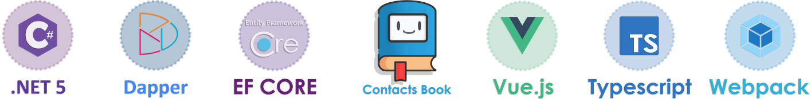
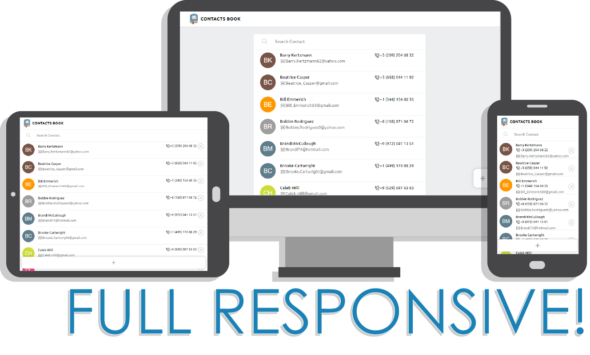
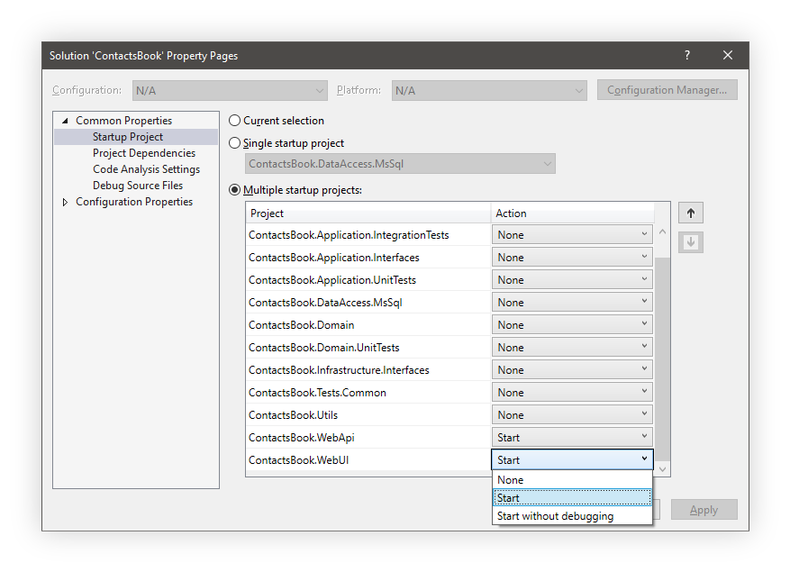

Web application for composing a contact book using **[Vue.JS 2][1]** and **[.Net 5][2]**<br>

## :blue_book: Description


The **backend** of the application is implemented using **[Asp.Net Core (Web Api)][3]**. The application architecture is structured according to **clean architecture**. **[Dapper][4]** is used to access the data.<br>
**Frontend** is implemented on **[Asp.Net][5]** technology using **[Vue.Js 2][1]**. **[Vuex][6]** is used to monitor the state of the application. For pagination, the "infinite loading" approach is used. Used **[Typescript][7]** for typing the application.

## :name_badge: Requirements
 - [.Net 5 SDK](https://dotnet.microsoft.com/download/dotnet/5.0)
 - [Node.js](https://nodejs.org/en/)
 - [Yarn](https://yarnpkg.com/)
 
## :zap: Local Run
The project has the following directory structure:
```
ContactsBook
├── README.md
├── .gitignore
├── ~ ~ ~
└── src
    ├── ~ ~ ~
    ├── ContactsBook.WebApi
    ├── ContactsBook.WebUI
    ├── ~ ~ ~
└── tests
    ├── ~ ~ ~
```
Executable assemblies are **`ContactsBook.WebApi`** and **`ContactsBook.WebUI`**<br>
You can run them in separate way or use specfied settings of your **IDE**:<br>
<br> 
**Bundles** are built when there is no `node_modules` folder in the **ContactsBook.WebUI** project. To manually build a project in **developer** or **production** mode use
```
// Installing all the dependencies of project
yarn install

// Development mode
yarn run dev
// Production mode
yarn run prod
```

[1]: https://vuejs.org/
[2]: https://docs.microsoft.com/en-us/dotnet/core/dotnet-five
[3]: https://docs.microsoft.com/ru-ru/aspnet/core/introduction-to-aspnet-core?view=aspnetcore-5.0
[4]: https://github.com/DapperLib/Dapper
[5]: https://docs.microsoft.com/ru-ru/aspnet/web-forms/
[6]: https://vuex.vuejs.org
[7]: https://www.typescriptlang.org/
